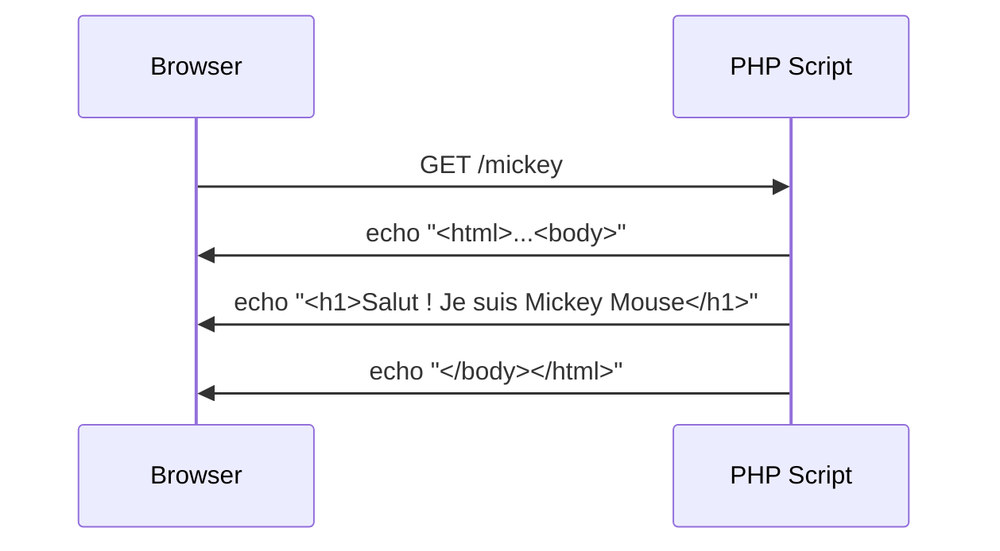
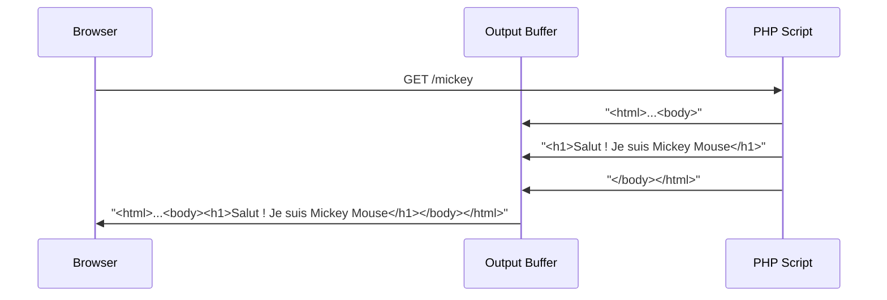

<div class="align-center">

# Comment fonctionne le profiler et la toolbar ?

<v-clicks>

- 📦 Bundle
- 🛂 Controllers
- 📰 Templates Twig
- <span v-mark="{ at: 5 }">👂 EventListener </span>

</v-clicks>

</div>

<style>
.align-center {
    text-align: center;
}
.align-center > ul {
  display: inline-block;
  text-align: left;
} 
</style>

---

# WebDebugToolbarListener

```php
/**
 * WebDebugToolbarListener injects the Web Debug Toolbar.
 *
 * The onKernelResponse method must be connected to the kernel.response event.
 *
 * The WDT is only injected on well-formed HTML (with a proper </body> tag).
 * This means that the WDT is never included in sub-requests or ESI requests.
 *
 * @author Fabien Potencier <fabien@symfony.com>
 */
class WebDebugToolbarListener implements EventSubscriberInterface
```

<v-click>
Fabpot committed on Sep 1, 2010 (15 years ago)
</v-click>

---

```php
public function onKernelResponse(ResponseEvent $event): void
{
    // ...
    if (
        self::DISABLED === $this->mode
        || !$response->headers->has('X-Debug-Token')
        || $response->isRedirection()
        || ($response->headers->has('Content-Type') && !str_contains($response->headers->get('Content-Type') ?? '', 'html'))
        || 'html' !== $request->getRequestFormat()
        || false !== stripos($response->headers->get('Content-Disposition', ''), 'attachment;')
    ) {
        return;
    }

    $this->injectToolbar($response, $request, $nonces);
}
```

---

```php {*|6-7|9|11-19|21|22|4}
/**
 * Injects the web debug toolbar into the given Response.
 */
protected function injectToolbar(Response $response, Request $request, array $nonces): void
{
    $content = $response->getContent();
    $pos = strripos($content, '</body>');

    if (false !== $pos) {
        $toolbar = "\n".str_replace("\n", '', 
            $this->twig->render('@WebProfiler/Profiler/toolbar_js.html.twig',
                [
                    'full_stack' => class_exists(FullStack::class),
                    'excluded_ajax_paths' => $this->excludedAjaxPaths,
                    'token' => $response->headers->get('X-Debug-Token'),
                    'request' => $request,
                    'csp_script_nonce' => $nonces['csp_script_nonce'] ?? null,
                    'csp_style_nonce' => $nonces['csp_style_nonce'] ?? null,
                ])
            )."\n";
        $content = substr($content, 0, $pos).$toolbar.substr($content, $pos);
        $response->setContent($content);
    }
}
```

<!-- 

Expliquez ce que chaque ligne fait

Mais du coup pourquoi ça ne fonctionne pas ?
Focus sur la methode > arg Response
 -->

---

# Les Responses de SF HttpFoundation

2 types de Responses : 

- Response

````md magic-move
```php
// FuturController extends AbstractController
$this->render('templateDuFutur.html.twig');
```
```php
$response ??= new Response();
$response->setContent($templateContent);
$response->send();
```
```php
$response ??= new Response();
$response->setContent($templateContent);
$response->sendHeaders();
$response->sendContent();
```
```php
$response ??= new Response();
$response->setContent($templateContent);
foreach ($newValues as $value) {
    header($name.': '.$value);
}
echo $templateContent;
```
````

- StreamedResponse

````md magic-move
```php
// FuturController extends AbstractController
$this->stream('templateDuFutur.html.twig');
```
```php
$response ??= new StreamedResponse();
$response->setCallback($templateGeneratorCallback);
$response->send();
```
```php
$response ??= new StreamedResponse();
$response->setCallback($templateGeneratorCallback);
$response->sendHeaders();
$response->sendContent();
```
```php
$response ??= new StreamedResponse();
$response->setCallback($templateGeneratorCallback);
foreach ($newValues as $value) {
    header($name.': '.$value);
}
($this->callback)();
```
````

<!-- Un peu simplifié mais dans l'idée c'est ça -->

---

# Mais du coup pourquoi ça marche pas ?

```php
class Response {
    public function __construct(?string $content = '', int $status = 200, array $headers = []) {
        // ...
    }
    // ...
    public function getContent(): string|false
    {
        return $this->content;
    }
}
```
<v-click>

```php
class StreamedResponse extends Response {
    // ...
    public function getContent(): string|false
    {
        return false;
    }
}
```

</v-click>

---


```php {6-7}
/**
 * Injects the web debug toolbar into the given Response.
 */
protected function injectToolbar(Response $response, Request $request, array $nonces): void
{
    $content = $response->getContent();
    $pos = strripos($content, '</body>');

    if (false !== $pos) {
        $toolbar = "\n".str_replace("\n", '', 
            $this->twig->render('@WebProfiler/Profiler/toolbar_js.html.twig',
                [
                    'full_stack' => class_exists(FullStack::class),
                    'excluded_ajax_paths' => $this->excludedAjaxPaths,
                    'token' => $response->headers->get('X-Debug-Token'),
                    'request' => $request,
                    'csp_script_nonce' => $nonces['csp_script_nonce'] ?? null,
                    'csp_style_nonce' => $nonces['csp_style_nonce'] ?? null,
                ])
            )."\n";
        $content = substr($content, 0, $pos).$toolbar.substr($content, $pos);
        $response->setContent($content);
    }
}
```

---

# Objectif : Capturer le contenu de la réponse streamée et injecter le HTML de la toolbar

---

# C'est là que le titre du talk entre en jeu 

<p>
    <SlideCurrentNo /> slides avant d'en parler, ça va non ?
</p>

---

# L'Output Buffer

---

<!-- Schéma d'un user/browser qui envoie une requete HTTP vers un serveur PHP qui renvoie une réponse avec pleins d'écho.
Changement du schéma pour ajouter une boite nommé OB qui va stopper les envois d'echo et stocker dans un buffer (aka dans la RAM, à vérifier)
OB activé par défaut via l'option `output_buffering` mais peut etre désactivé -->



---

<!-- Schéma d'un user/browser qui envoie une requete HTTP vers un serveur PHP qui renvoie une réponse avec pleins d'écho.
Changement du schéma pour ajouter une boite nommé OB qui va stopper les envois d'echo et stocker dans un buffer (aka dans la RAM, à vérifier)
OB activé par défaut via l'option `output_buffering` mais peut etre désactivé -->



---

# L'output buffer

<v-clicks>

- Natif à PHP
- System defined via `php.ini` : 
  -  `output_buffering=bool/int`
  -  `output_handler=string`

- User defined

</v-clicks>

<!-- 

Output buffering for "On"/"Off". int limits the size of buffer as bytes. This directive is always Off in PHP-CLI. 
output_handler redirect to a function (only build in functions)

-->

---

# Un peu de code : voir le statut de l'output buffer

```php {*}{class:'!children:text-xl'}
// output_buffering= On
echo "toto";
$status = ob_get_status();
dd($status);
```

<v-click>
<pre class="sf-dump" id="sf-dump-16033544" data-indent-pad="  " tabindex="0"><div class="sf-dump-search-wrapper sf-dump-search-hidden"> <input type="text" class="sf-dump-search-input"> <span class="sf-dump-search-count">0 of 0</span> <button type="button" class="sf-dump-search-input-previous" tabindex="-1"> <svg viewBox="0 0 1792 1792" xmlns="http://www.w3.org/2000/svg"><path d="M1683 1331l-166 165q-19 19-45 19t-45-19L896 965l-531 531q-19 19-45 19t-45-19l-166-165q-19-19-19-45.5t19-45.5l742-741q19-19 45-19t45 19l742 741q19 19 19 45.5t-19 45.5z"></path></svg> </button> <button type="button" class="sf-dump-search-input-next" tabindex="-1"> <svg viewBox="0 0 1792 1792" xmlns="http://www.w3.org/2000/svg"><path d="M1683 808l-742 741q-19 19-45 19t-45-19L109 808q-19-19-19-45.5t19-45.5l166-165q19-19 45-19t45 19l531 531 531-531q19-19 45-19t45 19l166 165q19 19 19 45.5t-19 45.5z"></path></svg> </button> </div><span class="sf-dump-label"></span> <span class="sf-dump-note" style="cursor: pointer;">array:1</span> [<a class="sf-dump-ref sf-dump-toggle" title="[Cmd+click] Expand all children"><span>▼</span></a><samp data-depth="1" class="sf-dump-expanded">
  <span class="sf-dump-index">0</span> =&gt; <span class="sf-dump-note" style="cursor: pointer;">array:7</span> [<a class="sf-dump-ref sf-dump-toggle" title="[Cmd+click] Expand all children"><span>▼</span></a><samp data-depth="2" class="sf-dump-expanded">
    "<span class="sf-dump-key">name</span>" =&gt; "<span class="sf-dump-str" title="22 characters">default output handler</span>"
    "<span class="sf-dump-key">type</span>" =&gt; <span class="sf-dump-num">0</span>
    "<span class="sf-dump-key">flags</span>" =&gt; <span class="sf-dump-num">112</span>
    "<span class="sf-dump-key">level</span>" =&gt; <span class="sf-dump-num">0</span>
    "<span class="sf-dump-key">chunk_size</span>" =&gt; <span class="sf-dump-num">0</span>
    "<span class="sf-dump-key">buffer_size</span>" =&gt; <span class="sf-dump-num">16384</span>
    "<span class="sf-dump-key">buffer_used</span>" =&gt; <span class="sf-dump-num">4</span>
  </samp>]
</samp>]
</pre>
</v-click>

<style>
@import "../sf-style.css"
</style>

<!-- 
On ne parlera pas des flags ajd mais c'est pour controler les actions que peut 
-->

---

```php {*}{class:'!children:text-2xl'}
// output_buffering = On
echo "toto";
ob_clean();
echo "tata";
```

<v-click>
tata
</v-click>

---


```php {*}{class:'!children:text-2xl'}
// output_buffering = off
echo "toto";
ob_clean();
echo "tata";
```

<v-click>
toto<br />
<b>Notice</b>:  ob_clean(): Failed to delete buffer. No buffer to delete in <b>/private/tmp/ob_trash/index.php</b> on line <b>4</b><br />
tata
</v-click>

---

# User defined

<v-click>

````md magic-move{class:'!children:text-2xl'}
```php
ob_start();
```
```php
ob_start();
echo "toto";
```
```php
ob_start();
echo "toto";
$content = ob_get_contents();
ob_end_clean();
```
```php
ob_start();
echo "toto";
$content = ob_get_clean();
```
````

<v-click>
&lt;empty&gt;
<br/>
</v-click>

<v-click>
string(4) "toto"
</v-click>


</v-click>

---

# User defined

````md magic-move{class:'!children:text-2xl'}
```php
ob_start();
echo "toto";
```
```php
ob_start();
echo "toto";
$content = ob_get_contents();
ob_flush();
```
```php
ob_start();
echo "toto";
$content = ob_get_flush();
```
````

<v-clicks>
<p>toto</p>
<p>string(4) "toto"</p>
</v-clicks>

---

# Start & Stop

<v-click>

- ob_start

</v-click>
<v-click>

- ob_clean
- ob_flush

</v-click>
<v-click>

- ob_end_clean
- ob_end_flush

</v-click>

---

# Récupérer son contenu

- ob_get_contents
- ob_get_clean
- ob_get_flush

---

# Comprendre l'output buffer

- ob_get_length
- ob_get_level
- ob_get_status
- ob_list_handlers

Source: https://www.php.net/manual/en/ref.outcontrol.php

---

````md magic-move
```php
protected function injectToolbar(Response $response, Request $request, array $nonces): void
{
    $content = $response->getContent();
    $pos = strripos($content, '</body>');

    if (false !== $pos) {
        $toolbar = "\n".str_replace("\n", '', 
            $this->twig->render('@WebProfiler/Profiler/toolbar_js.html.twig',
                [
                    'full_stack' => class_exists(FullStack::class),
                    'excluded_ajax_paths' => $this->excludedAjaxPaths,
                    'token' => $response->headers->get('X-Debug-Token'),
                    'request' => $request,
                    'csp_script_nonce' => $nonces['csp_script_nonce'] ?? null,
                    'csp_style_nonce' => $nonces['csp_style_nonce'] ?? null,
                ])
            )."\n";
        $content = substr($content, 0, $pos).$toolbar.substr($content, $pos);
        $response->setContent($content);
    }
}
```
```php {*|3|4-5|6-17|18|6|7|8|9-10|12-15|16}
protected function injectToolbar(Response $response, Request $request, array $nonces): void
{
    if ($response instanceof StreamedResponse) {
        $class = $this;
        $callback = $response->getCallback();
        $injectedCallback = static function () use ($class, $response, $request, $nonces, $callback): void {
            ob_start();
            ($callback)();
            $content = ob_get_contents();
            ob_end_clean();

            $pos = strripos($content, '</body>');
            if (false !== $pos) {
                $content = $class->renderToolbarInContent($content, $pos, $response->headers->get('X-Debug-Token'), $request, $nonces);
            }
            echo $content;
        };
        $response->setCallback($injectedCallback);
    } else { // ... }
}
```
````

---

🎉


---

# Moi devant ma contrib


---

# Ma contrib devant moi


---

# Pourquoi on utilise les StreamedResponse ?

<h2 v-click>
    Cas pratique : 
</h2>
<h2>
<v-clicks>
    <span>Export </span>
    <span>C</span>
    <span>S</span>
    <span>V</span>
</v-clicks>
</h2>


---

```php {*|1|2|4|5-12|13-16|18-22}
ini_set('memory_limit', '10M');
$users = $this->generateUsers(1000000);

$handle = fopen('php://temp', 'r+');
fputcsv($handle, ['ID', 'Nom', 'Email']);
foreach ($users as $user) {
    fputcsv($handle, [
        $user->getId(),
        $user->getName(),
        $user->getEmail()
    ]);
}

rewind($handle);
$csvContent = stream_get_contents($handle);
fclose($handle);

return new Response($csvContent, Response::HTTP_OK, [
        'Content-Type' => 'text/csv',
        'Content-Disposition' => 'attachment; filename="users.csv"',
    ]
);
```

---


<!-- Donc ce qu'on a fait, ça pue et on risque d'exploser la mémoire. -->

---

# La solution, une StreamedResponse


```php {*|1|2-14|3|4|6-13|15-17}
ini_set('memory_limit', '10M');
$response = new StreamedResponse(function () {
    $handle = fopen('php://output', 'w+');
    fputcsv($handle, ['ID', 'Nom', 'Email']);

    foreach ($this->generateUsers(1000000) as $user) {
        fputcsv($handle, [
            $user->getId(),
            $user->getName(),
            $user->getEmail()
        ]);
    }
    fclose($handle);
});
$response->headers->set('Content-Type', 'text/csv');
$response->headers->set('Content-Disposition', 'attachment; filename="users.csv"');

return $response;
```

---

🎉


---

# Les StreamedResponses c'est :

- plus rapide
- ne gloutonne pas votre mémoire 🍔🍕🍟

---

# Et dans notre cas ? 

<v-clicks>

On vient de supprimer la raison d'être des StreamedResponses


</v-clicks>

---

# Bon, comment on fait ?

---

```php {*|2|3|4|2}{class:'!children:text-2xl'}
ob_start(
    ?callable $callback = null, 
    int $chunk_size = 0, 
    int $flags = PHP_OUTPUT_HANDLER_STDFLAGS
): bool
```

---

```php {*|2|3}{class:'!children:text-3xl'}
handler(
    string $buffer, 
    int $phase = ?
): string
```
---


---

````md magic-move{class:'!children:text-2xl'}
```php
ob_start(function(string $buffer, int $phase) {
    return $buffer;
}, 1);

echo "toto\n";
echo "aFuP\n";
echo "PELO\n";

ob_end_flush();
```
```php
ob_start(function(string $buffer, int $phase) {
    return $buffer;
}, 1);

echo "toto\n"; // toto
echo "aFuP\n"; // aFuP
echo "PELO\n"; // PELO

ob_end_flush();
```
```php
ob_start(function(string $buffer, int $phase) {
    return strtoupper($buffer);
}, 1);

echo "toto\n";
echo "aFuP\n";
echo "PELO\n";

ob_end_flush();
```
```php
ob_start(function(string $buffer, int $phase) {
    return strtoupper($buffer);
}, 1);

echo "toto\n"; // TOTO
echo "aFuP\n"; // AFUP
echo "PELO\n"; // PELO

ob_end_flush();
```
````


<Alert type="warning" v-click>
Pas d'ob_start dans un handler
</Alert>

---

<!-- Exemple concret de la PR -->

```php {*|2|3|4-16|17|5-15|12|6-11}
if ($response instanceof StreamedResponse) {
    $callback = $response->getCallback();
    $toolbarHTMLContent = "\n".str_replace("\n", '', $this->getToolbarHTML($request, $response->headers->get('X-Debug-Token'), $nonces))."\n";
    $injectedCallback = static function () use ($toolbarHTMLContent, $callback): void {
        ob_start(function (string $buffer, int $phase) use ($toolbarHTMLContent): string {
            $pos = strripos($buffer, '</body>');
            if (false !== $pos) {
                $buffer = substr($buffer, 0, $pos).$toolbarHTMLContent.substr($buffer, $pos);
            }

            return $buffer;
        }, 8); // length of '</body>'

        ($callback)();
        ob_end_flush();
    };
    $response->setCallback($injectedCallback);
} else { // }
```

---

🎉


---

# One more thing

<v-click>

Amusons-nous à imbriquer des buffer partout !

</v-click>

---

# Faisons un FizzBuzz

<v-click>

1
2
Fizz
4
Buzz
Fizz
7
8
Fizz
Buzz
11
Fizz
13
14
FizzBuzz

</v-click>

---


```php {*|1|2-19|3|5|6-7|8-16|18-20|21}
ob_start();
foreach (range(1,15) as $number) {
    ob_start();

    echo "$number";
    $divisiblePar3 = $number % 3 === 0;
    $divisiblePar5 = $number % 5 === 0;
    if ($divisiblePar3 || $divisiblePar5) {
        ob_clean();
        ob_start();
        if ($divisiblePar3) {
            echo "Fizz";
        }
        if ($divisiblePar5) {
            echo "Buzz";
        }
    }
    echo "\n";
}
echo "\n\n";
var_dump(ob_get_status()['level']);
```

<v-click>
int(22)
</v-click>

<!-- 
Quel est le niveau de l'output buffer à la fin ? 22 Donc 23 OB

Pourquoi ça fonctionne ? 
Principe de poupée russe : 
1 OB 
dans 1 OB 
dans 1 OB
...
Une fois flush, il donne son content au parent, etc
-->

---

```php {*|1|2-21|3-7|8-16|17,20|23}
ob_start();
foreach (range(1,15) as $number) {
    ob_start();

    echo "$number";
    $divisiblePar3 = $number % 3 === 0;
    $divisiblePar5 = $number % 5 === 0;
    if ($divisiblePar3 || $divisiblePar5) {
        ob_clean();
        ob_start();
        if ($divisiblePar3) {
            echo "Fizz";
        }
        if ($divisiblePar5) {
            echo "Buzz";
        }
        ob_end_flush();
    }
    echo "\n";
    ob_end_flush();
}
echo "\n\n";
var_dump(ob_get_status()['level']);
```

<v-click>
int(0)
</v-click>

<!-- Combien cette fois ? -->

---

# Dans quels cas l'output buffer est intéressant ?

<v-clicks>

- Récupérer le code printé par un code tierce 
- Dev sur un framework

</v-clicks>

<div v-click mt-5>
Conseil : nettoyez bien les output buffer ouverts
<div class="i-carbon:arrow-right inline-block"/> complique les sessions de débug
</div>
